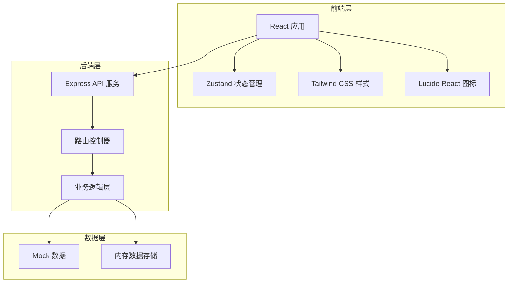
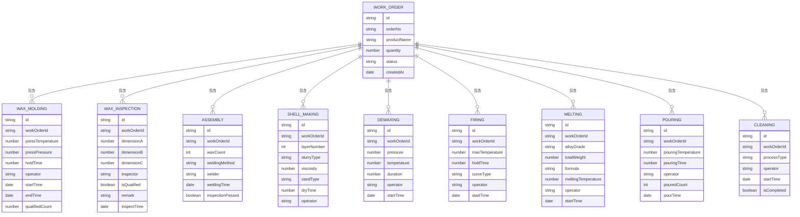

## 1. 架构设计

系统采用前后端分离架构，前端使用 React + TypeScript，后端使用 Express + TypeScript，数据存储采用本地 Mock 数据 + Zustand 状态管理。



## 2. 技术描述

- **前端框架**：React@18 + TypeScript
- **构建工具**：Vite@5
- **样式方案**：Tailwind CSS@3
- **状态管理**：Zustand
- **路由管理**：react-router-dom@6
- **图标库**：lucide-react
- **后端框架**：Express@4 + TypeScript
- **初始化工具**：vite-init
- **数据方案**：Mock 数据 + 内存存储

## 3. 路由定义

| 路由 | 页面 | 用途 |
|------|------|------|
| / | 首页仪表盘 | 生产数据概览、关键指标、工单列表 |
| /wax-molding | 蜡模压制 | 蜡模压制记录、蜡件尺寸检验 |
| /wax-inspection | 蜡件检验 | 蜡件尺寸检验详情 |
| /assembly-welding | 模组焊接 | 模组组树焊接管理 |
| /shell-making | 制壳挂砂 | 涂料粘度、制壳层数、干燥时长 |
| /dewaxing-firing | 脱蜡焙烧 | 脱蜡釜压力、型壳焙烧曲线 |
| /alloy-melting | 合金熔炼 | 中频炉熔炼配料管理 |
| /pouring | 浇注作业 | 浇注温度记录 |
| /cleaning-polishing | 清理打磨 | 切割飞边、打磨抛光 |

## 4. 数据模型

### 4.1 数据实体关系



### 4.2 核心数据类型定义

```typescript
// 工单状态
type WorkOrderStatus = 'pending' | 'wax_molding' | 'wax_inspection' | 'assembly' | 
  'shell_making' | 'dewaxing' | 'firing' | 'melting' | 'pouring' | 'cleaning' | 'completed';

// 工单
interface WorkOrder {
  id: string;
  orderNo: string;
  productName: string;
  productCode: string;
  quantity: number;
  status: WorkOrderStatus;
  currentProcess: string;
  createdAt: string;
  estimatedDelivery: string;
}

// 蜡模压制记录
interface WaxMoldingRecord {
  id: string;
  workOrderId: string;
  moldNo: string;
  waxMaterial: string;
  waxTemperature: number;
  moldTemperature: number;
  pressPressure: number;
  holdTime: number;
  cycleTime: number;
  operator: string;
  startTime: string;
  endTime: string;
  outputCount: number;
  qualifiedCount: number;
  remark?: string;
}

// 蜡件尺寸检验
interface WaxInspectionRecord {
  id: string;
  workOrderId: string;
  waxMoldingId: string;
  sampleNo: string;
  dimensions: { name: string; standard: number; actual: number; deviation: number; isQualified: boolean }[];
  surfaceQuality: string;
  isQualified: boolean;
  inspector: string;
  inspectTime: string;
  remark?: string;
}

// 模组焊接
interface AssemblyRecord {
  id: string;
  workOrderId: string;
  assemblyNo: string;
  waxCount: number;
  weldingMethod: string;
  weldingTemperature: number;
  welder: string;
  weldingTime: string;
  inspectionResult: boolean;
  inspector: string;
  remark?: string;
}

// 制壳记录
interface ShellMakingRecord {
  id: string;
  workOrderId: string;
  assemblyId: string;
  layerNumber: number;
  slurryType: string;
  viscosity: number;
  sandType: string;
  sandMesh: string;
  dryTime: number;
  dryTemperature: number;
  dryHumidity: number;
  operator: string;
  operateTime: string;
}

// 脱蜡记录
interface DewaxingRecord {
  id: string;
  workOrderId: string;
  kettleNo: string;
  pressure: number;
  temperature: number;
  duration: number;
  waxRecovery: number;
  operator: string;
  startTime: string;
  endTime: string;
  result: string;
  remark?: string;
}

// 焙烧记录
interface FiringRecord {
  id: string;
  workOrderId: string;
  furnaceNo: string;
  maxTemperature: number;
  holdTime: number;
  totalTime: number;
  curveData: { time: number; temperature: number }[];
  operator: string;
  startTime: string;
  endTime: string;
  remark?: string;
}

// 熔炼记录
interface MeltingRecord {
  id: string;
  workOrderId: string;
  furnaceNo: string;
  alloyGrade: string;
  totalWeight: number;
  materials: { name: string; weight: number; percentage: number }[];
  meltingTemperature: number;
  meltingTime: number;
  degassingTime: number;
  operator: string;
  startTime: string;
  compositionTest?: { element: string; content: number; standard: number }[];
}

// 浇注记录
interface PouringRecord {
  id: string;
  workOrderId: string;
  meltingId: string;
  shellCount: number;
  pouringTemperature: number;
  pouringSpeed: string;
  operator: string;
  pourTime: string;
  pouredCount: number;
  qualifiedCount: number;
  remark?: string;
}

// 清理打磨记录
interface CleaningRecord {
  id: string;
  workOrderId: string;
  processType: 'cutting' | 'grinding' | 'polishing';
  equipment: string;
  operator: string;
  startTime: string;
  endTime: string;
  quantity: number;
  qualityResult: string;
  remark?: string;
}
```

## 5. 项目结构

```
.
├── src/
│   ├── components/          # 通用组件
│   │   ├── Layout/         # 布局组件
│   │   ├── StatusBadge/    # 状态标签
│   │   ├── DataTable/      # 数据表格
│   │   ├── FormModal/      # 表单弹窗
│   │   └── StatCard/       # 统计卡片
│   ├── pages/              # 页面组件
│   │   ├── Dashboard/      # 首页仪表盘
│   │   ├── WaxMolding/     # 蜡模压制
│   │   ├── WaxInspection/  # 蜡件检验
│   │   ├── Assembly/       # 模组焊接
│   │   ├── ShellMaking/    # 制壳挂砂
│   │   ├── DewaxingFiring/ # 脱蜡焙烧
│   │   ├── Melting/        # 合金熔炼
│   │   ├── Pouring/        # 浇注作业
│   │   └── Cleaning/       # 清理打磨
│   ├── store/              # Zustand 状态管理
│   │   └── useStore.ts
│   ├── types/              # TypeScript 类型定义
│   │   └── index.ts
│   ├── data/               # Mock 数据
│   │   └── mockData.ts
│   ├── utils/              # 工具函数
│   │   └── format.ts
│   ├── App.tsx
│   ├── main.tsx
│   └── index.css
├── api/                    # 后端代码（可选）
├── package.json
├── vite.config.ts
├── tailwind.config.js
└── tsconfig.json
```
